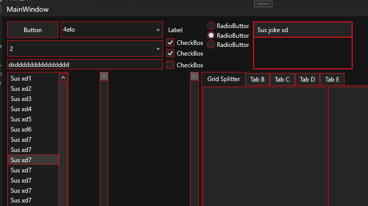

# BoldThemes
A remake of my older WPFThemes repo, only with a better colouring system (more customisable, spread into multiple resource dictionaries)

Control styles are in "Controls.xaml" and they all used the resources from "ControlColours.xaml" (which contains WPF's pre generated solid 
colour brushes with the exact same names). Those use the resources in your specific theme (e.g VeryDarkTheme.xaml) dynamically,
so you can change the theme and it should update 

## preview

